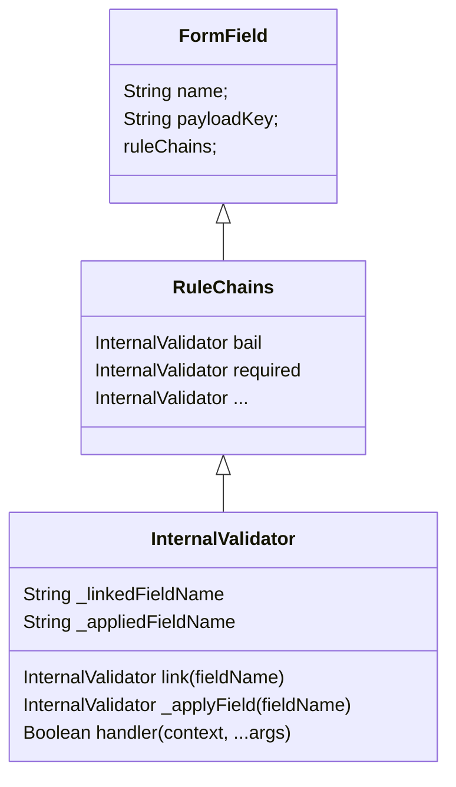
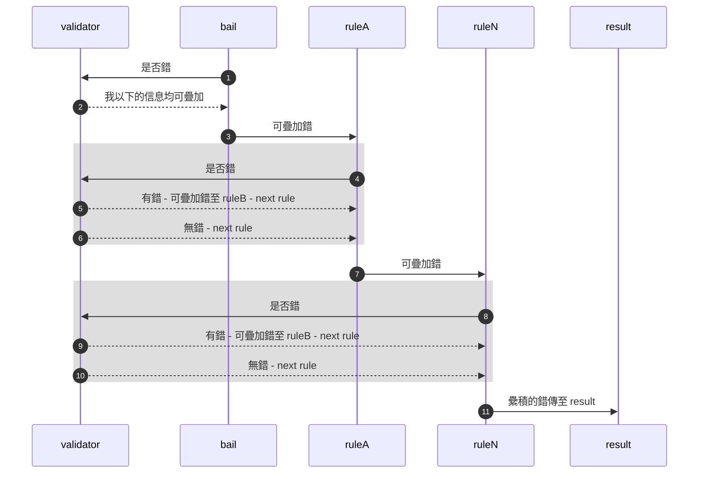
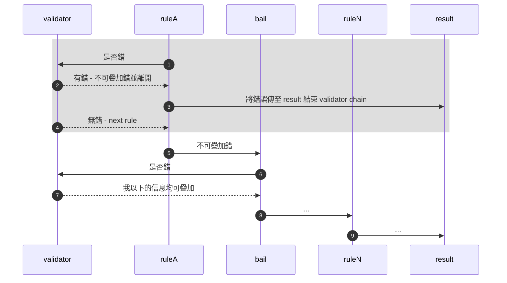

... 文件待補
# Overview:
# 安裝
```bash
yarn add @gdknot/frontend_common
```

# Feature

- 使用者自定義「驗證規則」／「驗證子」。
- 「驗證子」提供基本驗證邏輯，「驗證規則」由多個「驗證子」串連，以進行多層驗證。
- 「驗證子」支援雙欄位連結，以查找其他欄位進行驗證。
- 提供 ui 層輪入事件，以利ui整合
    - 事件
        - input
        - focus
        - unfocuse
    - 屬性
        - hasError
        - fieldErrors
        - canSubmit
    - submit mediator
        - beforeSubmit
        - onSubmit
        - afterSubmit
        - catchSubmit
- 相依分離於各大 UI framework (Vue/Reactive) －未完全測試

# 概述

一般表單驗證流程可分為，「欄位驗證」，「表單驗證」，「表單驗證」又包括蒐集原「欄位驗證」的錯誤集合與取得遠端錯誤集合，綜合以後再進行判斷，而「欄位驗證」又包括驗證子(Validator) 及驗證規則(Rule), 驗證規則是由許多驗證子（Validator) 所組成的，如，password 的驗證規則可能是由以下組成。

```ts
const passwordRule = [
	validators.required, validators.pwdLength, validators.pwdPattern
]
```

一個應用程式或網站，為了重複使用這些規則，可以進行全局定義，如：

```ts
export const fieldRules = defineFieldRules({
    validators: V,
    ruleChain: [
        {ident: EFieldNames.password, rules: ruleOfPassword},
        {ident: "confirmPassword", rules: [
            ...ruleOfPassword, V.confirm.linkField!({fieldName: EFieldNames.password})
        ]},
        {ident: "newPassword", rules: [
            ...ruleOfPassword, V.notEqual.linkField!({fieldName: EFieldNames.password})
        ]},
        {ident: "confirmNewPassword", rules: [
            ...ruleOfPassword, V.confirm.linkField!({fieldName: EFieldNames.newPassword})
        ]},
        {ident: "username", rules: [
            V.required, V.userLength, V.userPattern  
        ]},
        {ident: "nickname", rules: [
            V.required, V.nickLength, V.userPattern  
        ]},
        {ident: "remark", rules: [
            V.optional
        ]} ]})
```

並在對應的表單內容中重複使用，不同的欄位名稱需要定義不同的驗證規則，及驗證規則相應所需要的錯誤信息，如

```ts
const validatorMsg = defineValidationMsg({
    pwdPattern: computed(()=>"..."),
    pwdLength: computed(()=>"..."),
    ...
});
```

欄位設定包括了不同「欄位名」所需要的相應資料，如

- payloadKey
- validation rule
- defaultValue

```ts
export const fieldConfigs = defineFieldConfigs<Fields, V, R>({
    fieldRules,
    validators,
    configBuilder: (define)=>([
        // signup - password
        // signup - confirm_password
        define({
            fieldName: EFieldNames.confirmPasswordOnSignUp,
            payloadKey: "confirm_password",
            placeholder: computed(()=> ""),
            label: computed(()=> ""),
            ruleBuilder: (rules)=>{
                return rules.confirmPassword.rules;
            },
            valueBuilder: ()=>{
                return null;
            }
        }),
				define({
            fieldName: EFieldNames.password,
            payloadKey: "password",
            placeholder: computed(()=> ""),
            label: computed(()=> ""),
            ruleBuilder: (rules)=>{
                return rules.password.rules;
            },
            valueBuilder: ()=>{
                return "";
            }
        }),
```

當具備以上設定以後，便能重複利用以上設定套用在 UI 層，UI層的應用，應與任何 UI Framework，獨立出來，理論上應能夠被各大框架上使用（目前只測試過 Vue），不同ui framework 的 Reactive 方法以外部注入的方式注入，以達成相依分離，以下細部說明 Validator / Rule / FormField / FormConfig / FormModel 的構成。

- **Validator** － 驗證子，處理欄位基本驗證邏輯。
- **Rule** － 驗證規則，由多個驗證子串連。
- **FormConfig** － 表單設定，用來設定欄位名所對應相關的驗證設定方式。
- **FormField** － 欄位名對所對應的欄位物件，與 UI 連連結時會需要存取欄位物件。
- **Form** － 表單物件，包括表單處理及欄位集合所需的相關控制。

# Table of Content
<!-- START doctoc generated TOC please keep comment here to allow auto update -->
<!-- DON'T EDIT THIS SECTION, INSTEAD RE-RUN doctoc TO UPDATE -->
table of content

- [Overview:](#overview)
- [安裝](#%E5%AE%89%E8%A3%9D)
- [Feature](#feature)
- [概述](#%E6%A6%82%E8%BF%B0)
- [Table of Content](#table-of-content)
- [Validators 驗證子:](#validators-%E9%A9%97%E8%AD%89%E5%AD%90)
- [Validators](#validators)
  - [描述](#%E6%8F%8F%E8%BF%B0)
  - [InternalValidator](#internalvalidator)
    - [.handler](#handler)
    - [.validatorName](#validatorname)
    - [.linkField](#linkfield)
    - [EBaseValidationIdents](#ebasevalidationidents)
- [Rules 驗證規則:](#rules-%E9%A9%97%E8%AD%89%E8%A6%8F%E5%89%87)
- [Rules](#rules)
    - [**特殊 validator - bail**](#%E7%89%B9%E6%AE%8A-validator---bail)
  - [UDFieldRuleConfig](#udfieldruleconfig)
- [FormConfigs:](#formconfigs)
- [FormConfig](#formconfig)
  - [defineFormConfig](#defineformconfig)
    - [configBuilder - define 方法](#configbuilder---define-%E6%96%B9%E6%B3%95)
  - [defineValidators](#definevalidators)
  - [defineRules](#definerules)
  - [defineValidationMsg](#definevalidationmsg)
- [FormImpl:](#formimpl)
- [FormImpl](#formimpl)
  - [createFormModelOption](#createformmodeloption)
  - [**UDFormOption**](#udformoption)
  - [創建 FormImpl](#%E5%89%B5%E5%BB%BA-formimpl)
    - [by extend BaseFormImpl（class based）](#by-extend-baseformimplclass-based)
    - [by createReactiveFormModel](#by-createreactiveformmodel)
- [FormField:](#formfield)
- [FormFIeld](#formfield)
- [與UI整合:](#%E8%88%87ui%E6%95%B4%E5%90%88)
- [UI連接](#ui%E9%80%A3%E6%8E%A5)
  - [設值](#%E8%A8%AD%E5%80%BC)
  - [改變預設值](#%E6%94%B9%E8%AE%8A%E9%A0%90%E8%A8%AD%E5%80%BC)
    - [觸發事件](#%E8%A7%B8%E7%99%BC%E4%BA%8B%E4%BB%B6)
    - [驗證欄位(validate) - ruleChain](#%E9%A9%97%E8%AD%89%E6%AC%84%E4%BD%8Dvalidate---rulechain)
- [常見錯誤:](#%E5%B8%B8%E8%A6%8B%E9%8C%AF%E8%AA%A4)

<!-- END doctoc generated TOC please keep comment here to allow auto update -->


# Validators 驗證子:
# Validators

## 描述

可定義多個 validator，每個 validator 可以被單獨定義重複使用，不同 validator 彼此名稱不得重複，定義時需提供 ident(identity) 及 handler 屬性, ident 代表 validator 的唯一名稱, handler 則為處理驗證時所需的邏輯。

**exmaple**

> devineValidators([
     { identity: “validatorName”, handler(context, …args){  return true | false }}
])
> 

```ts
type V = {
	username: any;
	password: any;
} & (typeof EBaseValidationIdents);
const {validatorIdents, validators} = defineValidators<V>([
    {
      identity: "username",
      handler: (ctx, ...args)=>{
        return ctx.value == "John";
      }
    }
])
assert(validatorIdents.username == "username") 
validators.username // 對應至 InternalValidator 物件
// 以下未定義 password, 但 "password" 繼承至內部預設定義
assert(validatorIdents.password == "password") 
validatorIdents.password /// InternalValidator 物件 
```

- 當validator 依 defineValidator 方法所定義後，會將新增的 validator 名稱集合至 **validators | validatorIents,** 並繼承所有預設 validator，以供使用者可滙入引用, 預設 Validators 有哪些見 **EBaseValidationIdents**

- **defineValidator**
    
    defineValidator 用來生成內部所需要的 InternalValidator
    
    ```ts
    export function defineValidators<T, V = (typeof EBaseValidationIdents) & T>(
      option: UDValidator<V>[]
    ): {
      validatorIdents: Record<keyof V, keyof V>;
      validators: **InternalValidators**<V>;
    } {
    ```
    

- **InternalValidator** 有以下屬性
    - handler
    - validatorName
    - linkField
    - applyField - private
    - linkedFieldName - private
    - appliedFieldName - private

## InternalValidator

```ts
/**
   * @typeParam V - object containing keys of all validators
   * @typeParam F - payload schema for form fields
   * */
  export type InternalValidator<V, F = any> = {
    /** validator 驗證邏輯*/
    handler: ValidatorHandler<V, F>;
    /** 指派 validator 名，唯一名稱不得重複 */
    validatorName: keyof V;
    /** 用來連結其他欄位名 － linkField(fieldName) */
    linkField: InternalValidatorLinkHandler<V, F>;
    /** 將 validator 套用至欄位名 */
    _applyField?: InternalValidatorApplyHandler<V, F>;
    /** 連結的欄位名 */
    _linkedFieldName?: string;
    /** 套用的欄位名 */
    _appliedFieldName?: string;
  };
  /**
```



### .handler

返回 true 代表驗證通過，false 代表 驗證失敗, 驗證錯誤相關的錯誤信息定義，見**UDValidationMessage**

```ts
/**
   * Validator Handler 用來處理驗證邏輯， return true 代表驗證通過，false 不通過
   * @typeParam V - validator keys
   * @typeParam F - payload schema for form fields
   * @param ctx - validator context, 擴展至 {@link IBaseFormContext}, validator 屬性由 {@link BaseFormImpl.validate} 時 runtime 傳入
   * @param args - additional arguments
   *  __example:__
   *   ```typescript
   *   const baseFormRules = {
   *     [EBaseValidationRules.optional](ctx, ...args: any){
   *       return true;
   *     },
   *      [EBaseValidationRules.required](ctx, ...args: any){
   *       return v8n().not.empty().test(ctx.value);
   *     },
   *      [EBaseValidationRules.bail](ctx, ...args: any){
   *       ctx.displayOption.showMultipleErrors = true;
   *       return true;
   *     },
   *   }
   *  ```
   * */
  export type ValidatorHandler<V, F = any> = (
    ctx: IBaseFormContext<F, F, V> &  {validator?: InternalValidator<V>},
    ...args: any[]
  ) => boolean;
```

**example －簡單範例**

```ts
handler: (ctx, ...args)=>{
  return v8n().length(10, 30).test(ctx.value);
}
```

**example － 連結其他欄位：**

部份驗證規則需要連結其他欄位以進行驗證，如 confirm password 便需要 confirm_password 欄位與 password 欄位進行連結，以檢查其質是否一致

- context.getLinkedFieldName(validatorIdentity)
    
    以下例，透過 confirm 取得當前 context 中所連結的欄位名 **linkName**
    
- 並透過該被連結的欄位名，查找其欄位物件 (FormField)
- 由欄位物件取得該欄位目前的值 linkField.value
- 由 FormModel(context.model) 連結

```ts
/** 當欄位名為 sampleField_confirm, 則可用來匹配 欄位名 sampleFIeld */
[EBaseValidationIdents.confirm]: aValidator({
    validatorName: EBaseValidationIdents.confirm,
    handler(ctx, ...args: any[]) {
      const fieldName = ctx.fieldName; 
      const linkName = ctx.getLinkedFieldName(EBaseValidationIdents.confirm);
      assert(linkName != undefined);
      
      const linkField = ctx.model.getFieldByFieldName(linkName);
      const linkVal = linkField.value;
      
      ctx.model.link({
        master: { fieldName: ctx.fieldName as any, payloadKey: ctx.payloadKey },
        slave: { fieldName: linkField.fieldName, payloadKey: linkField.payloadKey }
      });

      return linkVal == ctx.value;
    },
  }),
```

### .validatorName

Validator 名稱（字串），不可重複名命，如重複名命則會覆寫定義。

### .linkField

用來連結其他欄位，如 confirm_password 需要與 password 欄位進行比對，因此當定義 confirm 這個 validator 時便需要考慮到欄位連結可能由外部傳入，這樣於 validator 內部就能夠依據外部傳入的 linkedFieldName 來取得相應的欄位值，如在定義 validation rules 時….

**example**:

```ts
export const fieldRules = defineFieldRules({
    validators: V,
    ruleChain: [
        {ident: EFieldNames.password, rules: ruleOfPassword},
        {ident: "confirmPassword", rules: [
            ...ruleOfPassword, V.confirm.linkField!({fieldName: EFieldNames.password})
        ]} ]})
```

以上 confirmPassword 的驗證規則為 ruleOfPassword 加上 confirm.linkField({fieldName: password}).

### EBaseValidationIdents

內部預設所定義的 validator identities，當validator 依 defineValidator 方法所定義後會自動繼承自 EbaseValidationIdents 內所有的 validator，使用者使用時不應直接用 EBaseValidationIdents，應使用 defineValidator 所返迴的 validatorIdents

```ts
/**
 * 預設 Validator 名, 可介由 {@link defineValidators} 擴展延伸
 */
 export enum EBaseValidationIdents {
  /** general user name regex pattern, 預設大小寫英文數字減號 */
  username = "username",
  /** 
   * todo: 指定 bail 推疊多個 validation rules, e.g: bail|username|userLength */
  bail = "bail",
  /** greater */
  greater = "greater",
  lesser = "lesser",
  /** 當欄位名取為為 fieldName_confirm 時, 則可用來匹配 欄位名 fieldName */
  confirm = "confirm",
  email = "email",
  remark = "remark",
  /** 用法和 confirm 一樣，只要找到 field name suffixed with _notEqual
   *  就代表其 prefix 為 notEqual 的比較對象
   * */
  notEqual = "notEqual",
  /** 無 rule, 不檢查*/
  optional = "optional",
  phone = "phone",
  /**8-30字*/
  pwdLength = "pwdLength",
  /** 大小寫英文數字(底線、減號、井號) 8-30字*/
  pwdPattern = "pwdPattern",
  /** 必填*/
  required = "required",
  /**  3字*/
  searchLength = "searchLength",
  /**  1-10字*/
  nickLength = "nickLength",
  /**  5-30字*/
  userLength = "userLength",
  amountLength = "amountLength",
  userPattern = "userPattern",
  decimalPattern = "decimalPattern",
  intPattern = "intPattern"
}
```

使用者如需存取 validator identities 應使用 defineValidato

```ts
export const {validatorIdents, validators} = defineValidators<V>([
  {
    identity: "username",
    handler: (ctx, ...args)=>{
      return ctx.value == "John";
    }
  }])
assert(validatorIdents.password == "password") 
```

# Rules 驗證規則:
# Rules

驗證規則由許多驗證子的集合構成，定義時需使用 defineFieldRules 方法，如下。

```ts
export const fieldRules = defineFieldRules({
    validators: V,
    ruleChain: [
        {ident: EFieldNames.password, rules: ruleOfPassword},
        {ident: "confirmPassword", rules: [
            ...ruleOfPassword, V.confirm.linkField!({fieldName: EFieldNames.password})
        ]}]})
fieldRules.password // **UDFieldRuleConfig 物件**
```

驗證時，驗證規則會線性式處理驗證規則內所有的驗證子，以 password 為例

```ts
const password = [V.required, V.pwdLength, V.pwdPattern]
```

當 input 事件發生進行驗證時，會先處理是否 required（必填）, 再處理 pwdLength(長度限制），最後處理 pwdPattern（字元限制），直到當中其中一個驗證子出現錯誤，因錯誤發生便沒有需要再繼續檢查下去，如此構成一個 validator chain，而有一些特殊的 validator 會影響 validator chain 的處理方式，能夠允許 validator chain 持續處理驗證錯誤，能夠堆疊多個驗證錯誤，如 bail 驗證子。

### **特殊 validator - bail**





## UDFieldRuleConfig

```ts
/**
   * 使用者自定義「驗證規則」設定
   * @typeParam V - validators
   * @typeParam R - 使用者自定義 rules {@link UDFieldRules}
   * @param ident - 「驗證規則」命名，字串名不可重複
   * @param rules - 「驗證規則」由許多「驗證子」的集合構成 @see {@link FormField}
   */
  export type UDFieldRuleConfig<R, V> = {
    ident: keyof R;
    rules: InternalValidator<V>[];
  };
```

- ident － 「驗證規則」命名，字串名不可重複
- rules － 「驗證規則」由許多「驗證子」的集合構成，也是欄位驗證邏輯的來源，見 FormField

# FormConfigs:


# FormConfig

FormConfig 主要用來生成 **Form** Implementation 所需要的一些相關設定，並非套件主要邏輯的部份，而是提供使用者一個較方便的介面，用以生成 **Form** Implementation，主要分為四個部份： 

- **defineValidators** -  定義驗證基本單元「驗證子」。
- **defineValidationMsg** - 定義「驗證子」發生錯誤時所顥示的「錯誤信息」。
- **defineRules** - 定義驗證規則，由許多「驗證子」溝成。
- **defineFormConfig** - 定義表單所需相關設定，包括注入以上三項定義。

## defineFormConfig

**型別定義**

```ts
/** 
 * 使用者自定義欄位設定
 * @typeParam F - 所有欄位 payload 型別聯集
 * @typeParam R - 使用者自定義 rules {@link UDFieldConfigs}
 * @see {defineFieldConfigs}
 */
export const defineFieldConfigs = function <F, V=any, R=any>(options: {
  fieldRules: R,
  validators: V,
  configBuilder: (define: UDFieldDefineMethod<F, V, R>) => FormField<F, F, V>[];
}): UDFieldConfigs<F, V> {
	...
}
```

**example**

完整範例見 **fomConfigUtil.test.setup.ts**

```ts
type Fields = SignUpPayload 
	& LoginPayload
	& UpdatePwdPayload;
type V = typeof validators;
type R = typeof fieldRules;
export const fieldConfigs = defineFieldConfigs<Fields, V, R>({
  fieldRules,
  validators,
  configBuilder: (define)=>([
      define({
          fieldName: "password",
          payloadKey: "password",
          placeholder: computed(()=> ""),
          label: computed(()=> ""),
          ruleBuilder: (rules)=>{
              return rules.password.rules;
          },
          valueBuilder: ()=>{
              return "";
          }
      }),
    ]),
		...
  })
```

### configBuilder - define 方法

```ts
/** 
  * 使用者自定義欄位設定, param options 繼承至 {@link FormField}
  * @typeParam F - 所有欄位 payload 型別聯集
  * @typeParam V - validators
  * @typeParam R - 使用者自定義 rules {@link UDFieldRules}
  * @param ruleBuilder - 需返迴驗證規則 {@link FieldRuleBuilder}
  * @param valueBuilder -  需返回 {@link FormValue}
  * @param fieldName - {@link FormField}
  * @param placeholder - {@link FormField}
  * @param hidden - {@link FormField}
  * @param disabled - {@link FormField}
  * @param label - {@link FormField}
  * @param fieldType - {@link FormField}
  * @param payloadKey - {@link FormField}
  */
export type UDFieldDefineMethod<F, V, R> = (
  option: Pick<
    FormField<F, F, V>,
    "placeholder" | "hidden" | "disabled" | "label" | "fieldType" | "payloadKey"
  > & {
    fieldName: string;
    ruleBuilder: FieldRuleBuilder<R, V>;
    valueBuilder: () => FormValue<F, F, V>;
  }
) => FormField<F, F, V>;
```

- fieldName - 欄位名稱
- payloadKey - 傳送至遠端的 payload 鍵名，同樣的 payload 鍵名可以有不同的欄位名稱，如 password 可能用於 userLogin / userRegister / userResetPassword，可以為這三種表單情境分別命名不同的欄位名，也可以視為同一個欄位名稱.

## defineValidators

**型別定義**

```ts
export function defineValidators<T, V = (typeof EBaseValidationIdents) & T>(
  option: {
    identity: keyof T;
    handler: ValidatorHandler<V>
  }[]
): {
  validatorIdents: Record<keyof V, keyof V>;
  validators: InternalValidators<V>;
} {
```

**example**

完整範例見 **fomConfigUtil.test.setup.ts**

```ts
export const {validatorIdents, validators} = defineValidators([
  {
    identity: EAdditionalValidatorIdents.occupationLength,
    handler: (ctx, ...args)=>{
      return v8n().length(10, 30).test(ctx.value);
    }
  },
  ...]);

validators.occupationLength // InternalValidator 物件;
assert(valiatorIdents.occupationLength == EAdditionalValidatorIdents.occupationLength);
```

## defineRules

**型別定義**

```ts
/**
 * 使用者自定義「驗證規則」（validation rules)，「驗證子」(validator) 定義 
 * @see {@link defineValidators}
 * @typeParam V - 繼承預設「驗證子」值鍵對 加上 R
 * @typeParam R - 使用者目前新增定義的驗證子值鍵對
 */
export const defineFieldRules = function <
  R, 
  V = (typeof EBaseValidationIdents) & R,
>(options: {
  validators: InternalValidators<V>;
  ruleChain: UDFieldRuleConfig<R, V>[];
}): UDFieldRules<R, V>
```

**example**

完整範例見 **fomConfigUtil.test.setup.ts**

```ts
export const fieldRules = defineFieldRules({
    validators: V,
    ruleChain: [
        {ident: EFieldNames.password, rules: ruleOfPassword},
        {ident: "confirmPassword", rules: [
            ...ruleOfPassword, V.confirm.linkField!({fieldName: EFieldNames.password})
        ]}]
});
fieldRules.nickname // UDFieldRuleConfig 物件
```

## defineValidationMsg

**型別定義**

```ts
/** 用來定義驗證規則所對應的驗證訊息
 * 鍵為欄位名，值必須為 {@link ComputedRef}，用來追踪i18n狀態上的變化
 * @typeParam V - validators 值鍵對
 */
export type UDValidationMsgOption<V> = Record<
  keyof (V),
  Optional<ComputedRef<string>>
>;

export const defineValidationMsg = function<V>(
  option: UDValidationMessages<V>
): UDValidationMessages<V>
```

**example**

完整範例見 **fomConfigUtil.test.setup.ts**

```ts
export const validationMessages = defineValidationMsg<V>({
    pwdLength: computed(()=>{
			return i18n.t.validationPwdLengthError
		}),
    pwdPattern: undefined,
    insureMatch: undefined,
});

assert(validationMessages.pwdLength == i18n.t.validationPwdLengthError.value);
assert(validationMessages.pwdPattern == `${undefinedValidationErrorMessage}"pwdPattern"`);
assert(validationMessages.insureMatch == `${undefinedValidationErrorMessage}"insureMatch"`);

```


# FormImpl:

# FormImpl

FormImpl 將 Validator / Rules / FormConfig 整合在一起，並提供一個接口，使ui 連接變的可行，

**改變 field 值**

- form.username.value = …

**取得欄位錯誤**

- form.username.hasError - boolean
- form.username.fieldError - string

**通知 input 事件發生**

- form.notifyOnInput(payloadKey, …);

**通知 focus 事件**

- form.notifyReFocus()

**手動驗證**

- form .validateAll()

**表單是否有錯誤**

- form.hasError

**表單是否可傳傳**

- form.canSubmit.value

當我們依以下方式定義出相關的全局設定後，便可以透過 **createFormModelOption** 創建 FormModel 所需要的設定：

- **defineValidators** -  定義驗證基本單元「驗證子」。
- **defineValidationMsg** - 定義「驗證子」發生錯誤時所顥示的「錯誤信息」。
- **defineRules** - 定義驗證規則，由許多「驗證子」溝成。
- **defineFormConfig** - 定義表單所需相關設定，包括注入以上三項定義。

## createFormModelOption

**型別定義**

```tsx
/** {@inheritDoc UDFormOption}
 * 用來生成繼承自  {@link BaseFormImpl} 所需的 option
 * @see {@link createReactiveFormModel} 
 * @typeParam F - payload schema
 * @typeParam V - validators
 * @param option - @see {@link UDFormOption}
*/
export const createFormModelOption = function<F, V = any, R=any>(
  option: UDFormOption<F, V, R>
): InternalFormOption <F, F, V>
```

```tsx
/** {@inheritDoc FormOption} 
 * 用來生成繼承自  {@link BaseFormImpl} 所需的 option 
 * 文件繼承自 @see {@link InternalFormOption}
 * @see {@link createFormModelOption}
 * @param config - {@link UDFieldConfigs}
 * @param pickFields - 選擇該 form model 需要哪些對應的 schema
*/
export interface UDFormOption<F, V, R> extends Omit<InternalFormOption<F, F, V>, "state"> {
  config: UDFieldConfigs<F, V> ,
  pickFields: (keyof (F & R))[],
}
```

```tsx
/** 
 * {@inheritDoc InternalFormConfig}
 * 文件繼承自 @see {@link InternalFormConfig}
 * @param validators - 全局所定義的 validator {@link defineValidators}
 * @param messages - 驗證錯誤所需的 message, {@link defineValidationMsg}
 * @param state - 由 {@link defineFieldConfigs} 所定義
 * @param postMethod - 定義向遠端請求的方法（submit)
 * @param resendPost - 
*/
export interface InternalFormOption<T, E, V> extends InternalFormConfig<T, E, V> {
  validators: V;
  state: FormState<T, E, V>;
  messages: UDValidationMsgOption<V>;
  postMethod: (...args: any[]) => any;
  resendPost?: (...args: any[]) => any;
} ;
```

```tsx
export interface InternalFormConfig<T, E, V> {
  /** dialog 標題*/
  title?: ComputedRef<string>;
  /** 傳入 dialog 是否 visible, 類別為 reactive  */
  visible?: UnwrapRef<{ value: boolean }>;
  /** 設計於 dialog visible 時呼叫 */
  onVisibleChanged?: (model: IBaseFormModel<T, E, V>, visible: boolean) => void;
  /** 設計於 dialog visible 前呼叫 notImplemented: */
  // onBeforeVisible?: (model: IBaseFormModel<T, E, V>, extra: any) => void;
  /** cancel / submit 後呼叫, 用於 dialog base form ui */
  onClose?: (model: IBaseFormModel<T, E, V>) => void;
  /** cancel {@link IBaseFormCtrl.cancel} 後呼叫 */
  onCancel?: (model: IBaseFormModel<T, E, V>) => void;
  /** 用於ui 使用者送出表單 {@link IBaseFormCtrl.submit} 後呼叫*/
  onSubmit?: (resp: any, model: IBaseFormModel<T, E, V>) => boolean;
  onNotifyRectifyingExistingErrors: () => void;
  /** submit {@link IBaseFormCtrl.submit} 後,  onSubmit 前呼叫 */
  onBeforeSubmit: () => void;
  /** submit {@link IBaseFormCtrl.submit} 後 ／ onSubmit 後呼叫 */
  onAfterSubmit: () => void;
  /** submit {@link IBaseFormCtrl.submit}  偵錯呼叫 */
  onCatchSubmit: (e: any) => void;
}
```

**example**

完整範例見 **formModel.test.setup.ts, scenarioFormModel.test.setup.ts**

```tsx
type F = Fields;
type V = typeof validators;
type R = typeof fieldRules;

export const createUserFormModelOption = createFormModelOption<F, V, R>({
  config: fieldConfigs,
  pickFields: [
    "username",
    "password",
    "nickname",
    "confirm_password",
    "confirm_new_password",
    "new_password",
    "remark",
    "card_number",
    "card_number_A",
    "card_number_B"
  ],
  postMethod(...args) {
    return { succeed: true };
  },
  validators,
  messages: validationMessages,
  onNotifyRectifyingExistingErrors: function (): void {
    throw new Error("Function not implemented.");
  },
  onBeforeSubmit: function (): void {
    throw new Error("Function not implemented.");
  },
  onAfterSubmit: function (): void {
    throw new Error("Function not implemented.");
  },
  onCatchSubmit: function (e: any): void {
    throw new Error("Function not implemented.");
  }
});
```

## **UDFormOption**

以下為 UDFormOption 的屬性

- **validators**
    
    全局所定義的 validator, 或由 [defineValidators](http://localhost:3000/functions/defineValidators.html) 所定義的 validators, 型別為 [InternalValidators](http://localhost:3000/types/InternalValidators.html)
    
- **messages**
    
    驗證錯誤所需的 message, [defineValidationMsg](http://localhost:3000/functions/defineValidationMsg.html)
    
- **postMethod**
    
    定義向遠端請求的方法（submit)
    
    **Example**
    
    ```tsx
     postMethod(payload){ return apiService.createUser(payload); }
    ```
    
- **onNotifyRectifyingExistingErrors**
- **onBeforeSubmit**
    
     [submit](http://localhost:3000/classes/IBaseFormCtrl.html#submit) 後, onSubmit 前呼叫
    
- **onAfterSubmit**
    
     [submit](http://localhost:3000/classes/IBaseFormCtrl.html#submit) 後 ／ onSubmit 後呼叫
    
- **onCatchSubmit**
    
     [submit](http://localhost:3000/classes/IBaseFormCtrl.html#submit) 偵錯呼叫
    
- **config**
    
    由 [defineFieldConfigs](http://localhost:3000/functions/defineFieldConfigs.html) 所生成的 [UDFieldConfigs](http://localhost:3000/types/UDFieldConfigs.html)
    
- **pickFields**
    
    選擇該 form model 需要哪些對應的 payload schema
    
    **example**
    
    ```tsx
    type F = Fields;
    type V = typeof validators;
    type R = typeof fieldRules;
    export const createUserFormModelOption = createFormModelOption<F, V, R>({
    
    ```
    
    以上 type F = Fields 中，指的是我們於 App 中所定義的一切與表單有關的payload， 以一般應用為例，如 App 中有以下payload。
    
    ```tsx
    type UserLogin = {username:string, password: string}
    type UserResetPwd = {password: string, new_password: string, confirm_new_password: string}
    
    ```
    
    則我們於 App 中所需所有與表單有關的 payload type F 則為
    
    ```tsx
    type Fields = UserLogin & UserResetPwd;
    type F = Fields
    
    ```
    
    而不同的表單有不同的 payload 定義，所以我們需要㨂選當前表單所需要的 payload, 這就是 pickFields 的作用，用來㨂選當前 Form 所需要的欄位。
    
- `**Optional`resendPost**
    
    重新送出 -Not Implemented
    
- `**Optional`title**
    
    用於 dialog ui 中的標題
    
- `**Optional`visible**
    
    visible?: {    value: *boolean*;}
    
    用來控制 dialog 是否 visible, 類別為 reactive
    
    **Example**
    
    ```tsx
    const createMerchantModel = new CreateMerchantForm({
       visible: toRef(dialogHandler, 'createDialog'),
       onSubmit(response, model){
         reRender();
         return true;
       }
     })
    ```
    
- `**Optional`onVisibleChanged**
    
    設計於 dialog visible 時呼叫
    
- `**Optional`onClose**
    
    cancel / submit 後呼叫, 用於 dialog form ui
    
- `**Optional`onCancel**
    
    [cancel](http://localhost:3000/classes/IBaseFormCtrl.html#cancel) 後呼叫
    
- `**Optional`onSubmit**
    
    用於ui 使用者送出表單 [submit](http://localhost:3000/classes/IBaseFormCtrl.html#submit) 後呼叫
    

## 創建 FormImpl

**創建 FromImpl 所需要的設定**

```tsx
type F = Fields;
type V = typeof validators;
type R = typeof fieldRules;

export const createUserFormModelOption = createFormModelOption<F, V, R>({
  config: fieldConfigs,
  pickFields: [
    "username",
    "password",
    "nickname",
    "confirm_password",
    "confirm_new_password",
    "new_password",
    "remark",
    "card_number",
    "card_number_A",
    "card_number_B"
  ],
  postMethod(payload) {
    return apiService.createUser(payload);
  },
  validators,
  messages: validationMessages,
  onNotifyRectifyingExistingErrors: function (): void {
    throw new Error("Function not implemented.");
  },
  onBeforeSubmit: function (): void {
    throw new Error("Function not implemented.");
  },
  onAfterSubmit: function (): void {
    throw new Error("Function not implemented.");
  },
  onCatchSubmit: function (e: any): void {
    throw new Error("Function not implemented.");
  }
});
```

### by extend BaseFormImpl（class based）

**example**

```tsx
export class CreateUserFormModel extends BaseFormImpl<F, F, V> {
  constructor(option: InternalFormOption<F, F, V>) {
    flattenInstance(super(option));
		// 改變 username 初始值
    this.state.username.value = "guest";
  }

  getPayload(): Record<FormKey<F, F, V>, any> {
    const result = super.getPayload();
    if (is.empty(result.remark)) {
      result.remark = null;
    }
    delete result.confirm_password;
    return result;
  }
}

export const userFormModel = new CreateUserFormModel(createUserFormModelOption);
```

### by createReactiveFormModel

**example**

```tsx
export const userFormModel = createReactiveFormModel({
  ...createUserFormModelOption,
  getPayload(_payload){
    const ret = _payload;
    if (is.empty(ret.remark)) {
      ret.remark = null;
    }
    delete ret.confirm_password;
    return ret;
  }
});
```

# FormField:

# FormFIeld

**型別**

```tsx
/**
 * 「表單欄位」所需的資料集合
 * @typeParam T 欄位主要 payload 型別
 * @typeParam E 欄位次要 payload 型別，用於延伸擴展，可以是空物件 // fixme: 沒必要
 *
 * */
export type FormField<T, E, V> = {
  /** 代表該欄位 payload 所使用的 key*/
  payloadKey: FormKey<T, E, V>;
  /** 代表該欄位表單名稱，於 validation rule 階段, 可用於 成對 validation rule 的匹配，如
   *  > - **confirm**  規則中 password 匹配於 password_confirm,
   *  > - **notEqual** 規則中 newPassword 匹配於 newPassword_notEqual*/
  fieldName: string;
  defaultValue: FormValue<T, E, V>;
  /** 代表當前 input 欄位的值，也是表單最後上傳 payload 的值 */
  value: FormValue<T, E, V>;
  /** label 用, 包於 computed, 需考慮語系 */
  label: ComputedRef<string>;
  /** rule 驗證規則, 由驗證子集合構成 **/
  ruleChain: InternalValidator<V, T & E>[];
  /** 欄位類型，給 UI 層作為 ui 層判斷用，此套件內部不處理欄位類型 */
  fieldType?: string;
  /** 欄位 placeholder, 需為 ComputedRef */
  placeholder: ComputedRef<string>;
  /** 用於非顯示用表單，如ID*/
  hidden?: boolean;
  /** 用於不可修改的表單，如某些希望顯示但不修改的欄位*/
  disabled?: boolean;
  /** @internal
   *  以字串顯示 form errors, 於內部生成
   *
   *  > 當 validation rules 沒有指定 bail 時，就算有多個規則錯誤
   *  > 只出現一筆 formError, 除非指定 bail, fieldError 才會顯示多筆錯誤
   *  > 當出現多筆錯誤時會以 "\n" line break symbol 連結錯誤字串
   * */
  fieldError?: string;
  /** @internal
   *  用於Validation 階段存於表單資料，於內部生成 */
  context?: IBaseFormContext<T, E, V>;
  hasError?: ComputedRef<boolean>;
};
```


# 與UI整合:

# UI連接

## 設值

- 外部設值

```tsx
const form = new CreateUserFormModel(createUserFormModelOption);
form.username.value = "hello";
form.notifyOnInput("username")
```

- ui 設值 (vue)

```tsx
<template lang="pug">
el-input(
  :placeholder="field.placeholder"
  v-model='field.value'
  type="field.fieldType"
  @input="()=>model.notifyOnInput(field.dataKey)"
)
.error-container
	span.error-sign(v-if="field.hasError")
	span.text-red {{field.fieldError}}
</template>
...
setup(){
	const form = new CreateUserFormModel(createUserFormModelOption);
	return {
		field: form.state.username
	}
}
```

## 改變預設值

- **formField.value / formField.defaultValue－** 於 constructor 內
    
    ```tsx
    export class BaseReactiveForm<F, V> extends BaseFormImpl<F, F, V> {
      constructor(option: InternalFormOption<F, F, V>) {
        flattenInstance(super(option));
    		this.state.username.defaultValue 
    			= this.state.username.value 
    			= "initial username";
      }
    }
    ```
    
    - **formFIeld.value** - 當前值
    - **formFIeld.defaultValue** - 預設值
    於 reset 方法觸發後，內部會將 defaultValue 設至 value以作為 reset 的參考來源
- f**orm.resetInitialState**
    
    ```tsx
    const form = new CreateUserFormModel(createUserFormModelOption);
    form.resetInitialState({
    	username: "initialUsername"
    });
    ```
    

### 觸發事件

- notifyOnInput (payloadKey)
- notifyOnFocus (payloadKey)
- notifyLeavingFocus (payloadKey)
  

### 驗證欄位(validate) - ruleChain

notifyOnInput 時會自動觸發 validate, 或者可以手動的方式 validate

- form.validate(payloadKey, extraArg)
- form.validateAll()
# 常見錯誤: 

