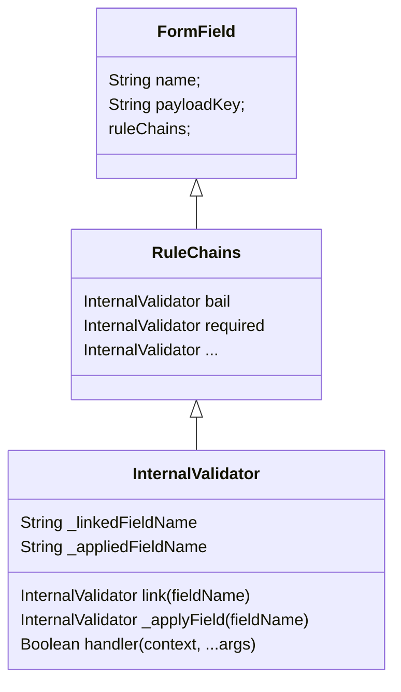

___
<!--#-->

## 描述

Validator(驗證子)，用來處理驗證邏輯最基本的單位，可定義多個 validator，每個 validator 可以被單獨定義重複使用，不同 validator 彼此名稱不得重複，定義時需提供 ident(identity) 及 handler 屬性, ident 代表 validator 的唯一名稱, handler 則為處理驗證時所需的邏輯。

**example**
```ts
const {validatorIdents, validators} = defineValidators([
    {
      identity: "username",
      handler: (ctx, ...args)=>{
        // ctx 為 context {@link }
        return ctx.value == "John";
      }
    }
]);
// validatorIdents 為 validator 名稱集合 (string enum)
assert(validatorIdents.username == "username") 
validators.username // 對應至 InternalValidator 物件
// 以下未定義 password, 但 "password" 繼承至內部預設定義
assert(validatorIdents.password == "password") 
validatorIdents.password /// InternalValidator 物件 
```

  > 當validator 依 defineValidator 方法所定義後，會將新增的 validator 自動繼承預設的 Validator 名稱集合至 **validators, validatorIdents,** ，以供使用者可滙入引用, 預設 Validators 有哪些見 **EBaseValidationIdents**

### defineValidators
  [source][s-defineValidators] | 
  用於使用者自定義／擴展 Validators, 並將 Validator render 成 [InternalValidator] | [source][s-InternalValidator] 供內部使用
  
  __型別__
  ```ts
    /**
    * 用於使用者自定義／擴展 Validators, 並將 Validator render 
    * 成 {@link InternalValidator} 供內部使用
    * @typeParam A - 新增的驗證子值鍵對
    * @typeParam V - 內部預設驗證子值鍵對
    */
    export function defineValidators<A, V = (typeof EBaseValidationIdents) & A>(
      option: UDValidator<A, V>[]
    ): {
      validatorIdents: Record<keyof V, keyof V>;
      validators: InternalValidators<V>;
    } 
  ```
  

### InternalValidator
[source][s-InternalValidator] | 
於內部使用的 Validator
__型別__
```ts
  /**
   * 於內部使用的 Validator
   * @typeParam V - object containing keys of all validators
   * @typeParam F - payload schema for form fields
   * */
  export type InternalValidator<V, F = any> = {
    /** 處理主要驗證邏輯*/
    handler: ValidatorHandler<V, F>;
    /** 指派 validator 唯一名稱不得重複 */
    validatorName: keyof V;
    /** 用來連結其他欄位名 － linkField(fieldName) 
     * @example
     * ```ts
     * const pwdRule = [
     *  V.required, V.password, V.confirm.linkField("password")
     * ]
     * ```
    */
    linkField: InternalValidatorLinkHandler<V, F>;
    /** @private 將 validator 套用至欄位名 - applyField(fieldName)*/
    _applyField?: InternalValidatorApplyHandler<V, F>;
    /** @private 連結的欄位名 */
    _linkedFieldName?: string;
    /** @private 套用的欄位名 */
    _appliedFieldName?: string;
  };
```
#### Validator  與 FormField 的關係
[source][s-FormField] | 



#### .handler

[source][s-InternalValidator] | 
返回 true 代表驗證通過，false 代表 驗證失敗, 驗證錯誤相關的錯誤信息定義，見 UDValidationMessage | [source][s-UDValidationMessage]

```ts
/**
   * Validator Handler 用來處理驗證邏輯， return true 代表驗證通過，false 不通過
   * @typeParam V - validator keys
   * @typeParam F - payload schema for form fields
   * @param ctx - validator context, 擴展至 {@link IBaseFormContext}, validator 屬性由 {@link BaseFormImpl.validate} 時 runtime 傳入
   * @param args - additional arguments
   * */
  export type ValidatorHandler<V, F = any> = (
    ctx: IBaseFormContext<F, F, V> &  {validator?: InternalValidator<V>},
    ...args: any[]
  ) => boolean;
```

**example －簡單範例**

```ts
handler: (ctx, ...args)=>{
  return v8n().length(10, 30).test(ctx.value);
}
```

**example － 連結其他欄位：**

部份驗證規則需要連結其他欄位以進行驗證，如 confirm password 便需要 confirm_password 欄位與 password 欄位進行連結，以檢查其質是否一致，以下例，欄位 confirm_password 欲匹配 password 的情況下，我們需要一個 confirm validator 可以用來匹配其他欄位，以比較其值是否一致，這個時候我們就能夠以 

- context.getLinkedFieldName
  
  取得連結的欄位名稱

- context.model.getFieldByFieldName 
  
  取得欄位物件

```ts
[EBaseValidationIdents.confirm]: aValidator({
    validatorName: EBaseValidationIdents.confirm,
    handler(ctx, ...args: any[]) {
      const fieldName = ctx.fieldName; 
      // 取得連結欄位名
      const linkName = ctx.getLinkedFieldName(EBaseValidationIdents.confirm);
      assert(linkName != undefined);
      // 透過欄位名取得欄位物件
      const linkField = ctx.model.getFieldByFieldName(linkName);
      const linkVal = linkField.value;
      return linkVal == ctx.value;
    },
  }),
```

#### .validatorName

[source][s-InternalValidator] | 
> Validator 名稱（字串），不可重複名命，如重複名命則會覆寫定義。

#### .linkField 

[source][s-InternalValidator] |

> 用來連結其他欄位，如 confirm_password 需要與 password 欄位進行比對，因此當定義 confirm 這個 validator 時便需要考慮到欄位連結可能由外部傳入，這樣於 validator 內部就能夠依據外部傳入的 linkedFieldName 來取得相應的欄位值，如在定義 validation rules 時….

**example**:

```ts
export const fieldRules = defineFieldRules({
    validators: V,
    ruleChain: [
        {ident: EFieldNames.password, rules: ruleOfPassword},
        {ident: "confirmPassword", rules: [
            ...ruleOfPassword, V.confirm.linkField!({fieldName: EFieldNames.password})
        ]} ]})
```

> 以上 confirmPassword 的驗證規則為 ruleOfPassword 加上 confirm.linkField({fieldName: password}).

#### EBaseValidationIdents

[source][s-baseValidators] |

> 內部預設所定義的 validator identities，當validator 依 defineValidator 方法所定義後會自動繼承自 EBaseValidationIdents 內所有的 validator，使用者使用時不應直接用 EBaseValidationIdents，應使用 defineValidator 所返迴的 validatorIdents

```ts
/**
 * 預設 Validator 名, 可介由 {@link defineValidators} 擴展延伸
 */
 export enum EBaseValidationIdents {
  /** general user name regex pattern, 預設大小寫英文數字減號 */
  username = "username",
  /** 
   * todo: 指定 bail 推疊多個 validation rules, e.g: bail|username|userLength */
  bail = "bail",
  /** greater */
  greater = "greater",
  lesser = "lesser",
  /** 當欄位名取為為 fieldName_confirm 時, 則可用來匹配 欄位名 fieldName */
  confirm = "confirm",
  email = "email",
  remark = "remark",
  /** 用法和 confirm 一樣，只要找到 field name suffixed with _notEqual
   *  就代表其 prefix 為 notEqual 的比較對象
   * */
  notEqual = "notEqual",
  /** 無 rule, 不檢查*/
  optional = "optional",
  phone = "phone",
  /**8-30字*/
  pwdLength = "pwdLength",
  /** 大小寫英文數字(底線、減號、井號) 8-30字*/
  pwdPattern = "pwdPattern",
  /** 必填*/
  required = "required",
  /**  3字*/
  searchLength = "searchLength",
  /**  1-10字*/
  nickLength = "nickLength",
  /**  5-30字*/
  userLength = "userLength",
  amountLength = "amountLength",
  userPattern = "userPattern",
  decimalPattern = "decimalPattern",
  intPattern = "intPattern"
}
```

使用者如需存取 validator identities 應使用 defineValidator

```ts
export const {validatorIdents, validators} = defineValidators<V>([
  {
    identity: "username",
    handler: (ctx, ...args)=>{
      return ctx.value == "John";
    }
  }])
assert(validatorIdents.password == "password") 
```

