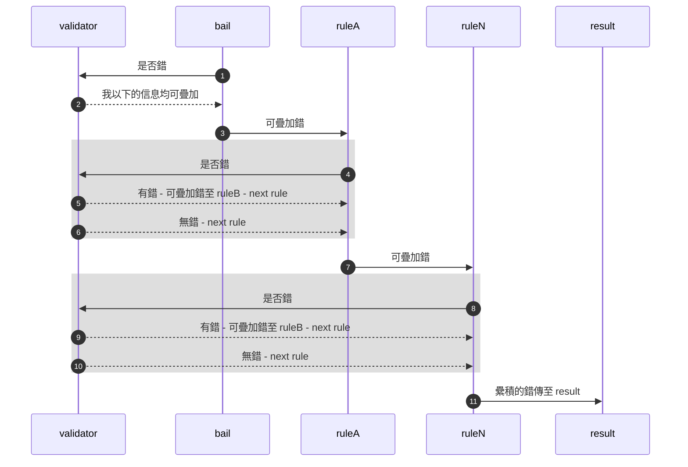
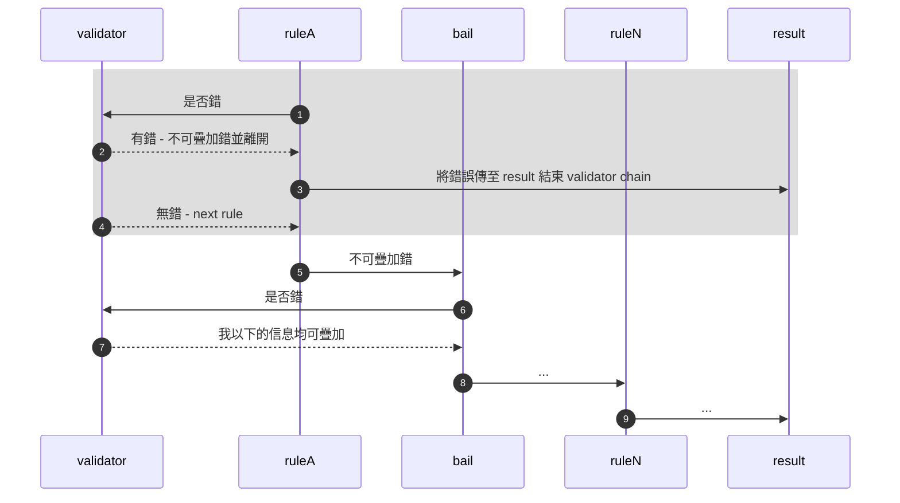

---
<!--#-->

驗證規則由許多個驗證子的集合構成，多個驗證子集合成一個驗證挸則，並將驗證挸則套用在特定的欄位上，如處理密碼的驗證規則需包括多個驗證子，如下： 

```ts
const V = validators;
const treasurePasswordRule = [
  V.pwdLength, V.pwdPattern
]
const userPasswordRule = [
  V.required, V.pwdLength, V.pwdPattern
]
const confirmPasswordRule = [
  ...passwordRule, V.confirm.linkField("password")
]
```
不同的驗證規則適用於不同的情境，不同的表單，定義時需使用 defineFieldRules 方法，如下。

```ts
enum EFieldName {
  confirmPassword="confirmPassword",
  password="generalPassword",
  treasurePassword="treasurePassword"
}
export const fieldRules = defineFieldRules({
  validators: V,
  ruleChain: [
    {ident: EFieldNames.treasurePassword, rules: treasurePasswordRule},
    {ident: EFieldNames.password, rules: userPasswordRule},
    {ident: "confirmPassword", rules: [
      ...ruleOfPassword, V.confirm.linkField!({fieldName: EFieldNames.password})
    ]}
  ]})
fieldRules.password // UDFieldRuleConfig 物件
```

驗證時，驗證規則會線性式處理驗證規則內所有的驗證子，以 password 為例

```ts
const password = [V.required, V.pwdLength, V.pwdPattern]
```

當 input 事件發生進行驗證時，會先處理是否 required（必填）, 再處理 pwdLength(長度限制），最後處理 pwdPattern（字元限制），直到當中其中一個驗證子出現錯誤，因錯誤發生便沒有需要再繼續檢查下去，如此構成一個 validator chain，而有一些特殊的 validator 會影響 validator chain 的處理方式，能夠允許 validator chain 持續處理驗證錯誤，能夠堆疊多個驗證錯誤，如 bail 驗證子。

### **特殊 validator - bail**





## UDFieldRuleConfig

[source][s-UDFieldRuleConfig] | 

```ts
/**
   * 使用者自定義「驗證規則」設定
   * @typeParam V - validators
   * @typeParam R - 使用者自定義 rules {@link UDFieldRules}
   * @param ident - 「驗證規則」命名，字串名不可重複
   * @param rules - 「驗證規則」由許多「驗證子」的集合構成 @see {@link FormField}
   */
  export type UDFieldRuleConfig<R, V> = {
    ident: keyof R;
    rules: InternalValidator<V>[];
  };
```

- ident － 「驗證規則」命名，字串名不可重複
- rules － 「驗證規則」由許多「驗證子」的集合構成，也是欄位驗證邏輯的來源，見 [FormField] | [source][s-FormField]


